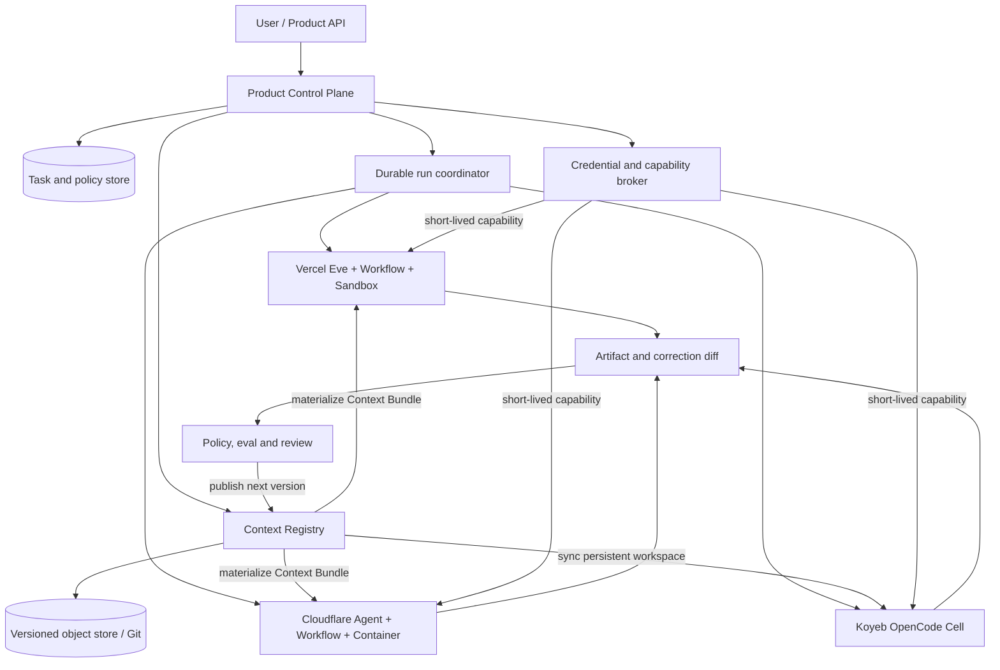

# Context Infrastructure 在线服务化分析

> 状态：架构判断稿  
> 日期：2026-07-16  
> 范围：Vercel eve、Cloudflare Agents、Koyeb 容器与完整 OpenCode runtime

## 结论先行

Context Infrastructure 与 Vercel、Cloudflare、Koyeb 这类 Agent Platform **不构成根本冲突**。它们解决的是不同层的问题：Context Infrastructure 管理可迁移的认知资产和 Agent 工作现场，平台管理身份、隔离、调度、持久执行与基础设施生命周期。

真正需要修正的是一个过强的假设：**filesystem 不应被定义成整个在线服务的唯一真相源，而应被定义成 Agent 的统一工作界面、可检查投影视图和可退出格式。**

数据库可以拥有账户、权限、任务状态和计费真相；Workflow 可以拥有执行历史；credential broker 可以拥有能力授权；对象存储或 Git 可以拥有版本化 Context Bundle。运行时再把这些内容 materialize 成 Agent 可读写的目录。这样既保留 filesystem-first 的 inspectability、composability 和 portability，又不需要假装所有生产系统语义都能被文件覆盖。

因此推荐的目标形态不是“把完整 OpenCode 搬进每一个平台”，也不是“为每个平台重写一套 Agent”，而是：

> **Portable Context Kernel + Native Runtime Shells**

- Portable Context Kernel 保存 Markdown skills、长期知识、correction ledger、工具能力声明和可迁移工作产物。
- Native Runtime Shell 对接 Eve、Cloudflare Agents 或 OpenCode，负责把 kernel 投影为本地目录，并适配平台的 tool、session、sandbox 和 credential 语义。
- 外部 Control Plane 管理用户、任务、授权、版本和运行记录，不把某个 harness 的 session 当成产品级 task。
- 完整 OpenCode 容器保留为参考 runtime、复杂任务工作台和退出通道，但不是唯一的生产部署方式。

## 谁更“正确”

两边都正确，但各自在不同边界内正确。

Context Infrastructure 正确地指出：Agent 的长期价值不只在一次模型调用，而在持续积累、可检查、可修改、可迁移的上下文。把所有能力锁进某个平台的 TypeScript SDK、私有数据库或 dashboard，会让用户无法真正拥有自己的 Agent。

Managed Agent Platform 也正确地指出：在线服务不能仅靠目录约定解决多租户身份、并发写入、durable execution、credential isolation、计费和故障恢复。把这些问题全部压给 filesystem，会重新发明一个更差的数据库、workflow engine 和 secret manager。

OpenCode 本身也不是完全中性的抽象。Markdown instructions 和 skills 很可迁移，但 session schema、tool protocol、event stream、permission model 与 server lifecycle 仍然属于 OpenCode harness。把 OpenCode 容器化能获得部署可移植性，却不会自动获得多租户产品语义。

更准确的分工是：

| 层 | 应拥有的真相 | 不应被谁替代 |
| --- | --- | --- |
| Context Kernel | skills、知识、纠正、可迁移产物 | 不应被平台专有 SDK 锁定 |
| Product Control Plane | 用户、tenant、task、policy、billing | 不应被 harness session 替代 |
| Durable Runtime | step、retry、timeout、resume、event history | 不应被一个常驻进程假装实现 |
| Credential Plane | identity、scope、lease、audit | 不应由 workspace 中的明文 key 承担 |
| Runtime Workspace | 当前任务所需的文件投影和临时产物 | 不应被误认为所有业务数据的唯一存储 |

## 四类表面冲突

### 1. Harness、Tool 与 Skill 格式

这里的冲突比最初设想的小。以本 Demo 使用的 eve 为例，skill 本身仍然可以是 Markdown；TypeScript 主要承担 typed tool、Agent 声明和平台接入。真正的平台差异不是“Markdown 对 TypeScript”，而是：

- 不同 harness 如何发现和加载 skill。
- tool schema、stream event 和 permission 如何表达。
- sandbox、network 与 retry 的生命周期由谁管理。
- harness session 如何关联产品用户和 durable task。

建议把可迁移部分定义成 Context Bundle，把不可避免的平台代码定义成 runtime adapter：

```text
context-bundle/
  manifest.json
  instructions/
  skills/
  knowledge/
  corrections/
  capabilities/
  artifacts/
```

其中 `manifest.json` 保存 schema version、内容 hash、兼容性和依赖；`capabilities/` 声明语义能力，例如 `web.search`，而不是直接规定 Eve tool、OpenCode command 或 Cloudflare binding。每个 runtime adapter 将语义能力映射为本平台的 typed tool。

typed tool 不是对 filesystem-first 的背叛。它在不可信输入、网络访问和 credential 边界上提供校验，是线上产品需要的 anti-corruption layer。需要避免的是把业务方法论和长期知识也埋进 adapter 代码。

不能追求“零 adapter”。更合理的成功标准是：同一个 Context Bundle 不改内容即可进入多个 harness；adapter 只处理生命周期、安全边界和协议差异，并通过 conformance tests 验证行为。

### 2. 用户持久数据与 Transient Filesystem

Sandbox 的本地 filesystem 可以是短暂的，但 filesystem-first 不要求底层介质必须是同一块永久磁盘。它要求 Agent 在工作时看到稳定、可理解的文件界面，并且重要变更能回写到用户拥有的长期存储。

建议将数据拆成四类：

| 数据 | Canonical owner | Runtime 中的形态 | 结束时处理 |
| --- | --- | --- | --- |
| 账户、ACL、task、billing | 关系数据库或平台状态存储 | 只读 metadata / API | 不由 Agent 任意改写 |
| Context Bundle | 对象存储、Git 或版本化 context service | materialized directory | 生成受控 diff / 新版本 |
| 大型用户文件 | 对象存储 | 按需下载、mount 或 lazy fetch | 上传新对象并记录引用 |
| 临时推理现场 | Sandbox filesystem | 普通文件和目录 | 选择性提升为 artifact，其余丢弃 |

semantic index 也不应成为 canonical knowledge。它是可以从原始文件重新生成的 derived state。这样 embedding provider、index implementation 或平台变化时，不会丢失知识资产。

关键不是让每次运行共享同一块磁盘，而是建立确定的 materialize / diff / commit 协议：

```text
Context version N
  -> materialize 到隔离 workspace
  -> Agent 读取、搜索、产生文件和 correction proposal
  -> 收集允许回写的 diff
  -> policy / eval / human review
  -> 发布 Context version N+1
```

这比让多个并发 Agent 直接写同一个持久 volume 更安全，也更容易审计和回滚。

### 3. Credential Management

“通过 CLI 使用能力”不等于“把 API key 放进 CLI 进程”。在多租户服务中，workspace 中不应出现平台级长期 secret，即使用户之间已经用容器隔离。Prompt injection 仍可能让 Agent 读取并外传自己容器内的 secret；per-user container 只缩小 blast radius，不能消除问题。

推荐把 credential 改成 capability lease：

```text
Agent tool / CLI
  -> 请求 web.search 能力
  -> runtime 注入短期、限域、限预算的 workload identity
  -> credential proxy / egress broker 代签或转发上游请求
  -> audit log 记录 tenant、capability、budget 和结果状态
```

不同部署环境可以有不同 resolver：

- Vercel 可以使用 platform identity、Sandbox network policy 与服务端 broker。
- Cloudflare 可以用 service binding、secret binding 和 Durable Object / Worker 中的代理边界。
- Koyeb 上可自建 credential gateway，通过 workload JWT 或 mTLS 鉴别 OpenCode cell。
- 本地单用户开发可以临时使用 process env，但不能把这种 fallback 当成多租户生产设计。

Context Bundle 只保存 capability reference 和 policy，不保存 credential。用户自带 key 也应进入专门的 secret store，并以短期授权投影给任务，而不是写进用户 workspace。

### 4. Task 与 Session Management

最大的语义误区是把 harness session 当成产品 task。

- Product task 表示用户意图、输入版本、权限、预算、状态和结果承诺。
- Durable run 表示 step、retry、timeout、signal、resume 与执行历史。
- Harness session 表示一次模型上下文和 tool interaction history。
- Sandbox / container 表示某一段执行的隔离环境。

它们应该有显式映射，而不是共用一个 ID：

```text
task_id
  -> run_id(s)
     -> runtime_instance_id(s)
        -> harness_session_id(s)
```

一个 task 可能因为 retry、human approval 或 runtime migration 产生多个 run；一个 run 可能在 compaction 或故障恢复后产生多个 harness session。外部 Control Plane 应保存映射和幂等边界，OpenCode、Eve 或 Cloudflare Agent 只负责自己的上下文语义。

## 推荐目标架构



这个架构有五个不可妥协的接口。

**1. Context Bundle contract**

Bundle 使用开放文件格式，拥有确定版本和内容 hash。Markdown 是 instructions、skills 和知识的默认格式；JSON 只用于 manifest、事件和机器校验字段。Bundle 可以完整导出，不依赖某个 SaaS 才能读取。

**2. Runtime adapter contract**

Adapter 至少实现 `materialize`、`expose capabilities`、`stream events`、`collect artifacts` 和 `propose context diff`。平台特有 tool schema 只存在于这一层。

**3. Task envelope**

每次执行都携带不可变的 tenant、task、context version、policy version、budget 和 capability grants。Harness prompt 不是授权来源。

**4. Credential broker**

运行环境获得的是能力，不是上游长期 secret。授权必须可限域、限时、限预算、撤销和审计。

**5. Correction pipeline**

self-evolution 不能等于“模型直接覆盖生产 skill”。用户纠正先成为 append-only correction event，再生成 proposal，通过回放测试、policy 或人工审核后发布新 Bundle。个人 Agent 可以有更宽松的自动升级策略，但仍需保留 diff 和回滚点。

## 两条可行路线

### 路线 A：Native Platform Adapter

在 Vercel 上使用 Eve、Workflow 和 Sandbox，在 Cloudflare 上使用 Agent / Durable Object、Workflow 和 Container。Context Bundle 在任务启动时投影到 runtime，平台原生能力负责 durable execution、身份与观测。

优点：

- 能直接获得平台提供的 retry、scale-to-zero、隔离、streaming 和 observability。
- typed tool 与 capability broker 的安全边界清楚。
- 对面向用户的异步任务、审批和恢复更自然。

代价：

- 每个平台都需要维护 adapter 和 conformance tests。
- harness session 和 tool event 无法做到字节级一致。
- 某些依赖完整 POSIX 环境的高级能力需要落到 Sandbox / Container。

这条路线适合作为公开、多租户、durable Agent 产品的主路径。

### 路线 B：完整 OpenCode Cell

为每个用户或高信任 tenant 运行一个隔离 OpenCode server/container，通过 persistent volume 保存 workspace，由外部 Control Plane 调用 OpenCode HTTP API 和 event stream。

最低生产要求包括：

- per-user 或 per-tenant trust boundary，而不是共享可执行 workspace。
- 持久 workspace 和独立的 canonical backup / versioning。
- 外部 task store 和 run coordinator；OpenCode session 不承担 durable task。
- credential gateway，避免平台 key 进入容器环境。
- egress policy、resource quota、idle suspend 和版本 pin。
- runtime 被杀死后可从 task envelope、Context Bundle 和 artifact checkpoint 恢复。

Koyeb 这类标准容器平台是最直接的 lift-and-shift 选择，因为它对进程、端口和 filesystem 的约束最少。但“能启动 OpenCode server”不等于“已经得到 Agent Platform”：task durability、credential broker、tenant isolation、volume lifecycle 和升级策略仍由我们负责。

OpenCode 也可以作为 Vercel Sandbox 或 Cloudflare Container 中按需启动的 execution engine，而不必常驻。此时 session continuity 应通过外部事件与 workspace checkpoint 恢复，不能依赖原进程永远存在。

这条路线适合内部工具、复杂 coding / knowledge work、早期 MVP，以及需要最大 harness 能力和最低迁移成本的场景。它也应长期作为 Context Kernel 的 reference implementation 和 escape hatch。

## 平台选择不是单选题

| 平台形状 | 最自然的 ownership | 适合的 Context Infrastructure 形态 | 主要风险 |
| --- | --- | --- | --- |
| Vercel Eve + Workflow + Sandbox | Workflow 拥有 run，Sandbox 拥有短暂执行现场 | Native adapter + 每次 materialize Bundle | 把 Eve session 误当产品 task；过度依赖平台 event schema |
| Cloudflare Agent + Durable Object + Workflow / Container | per-ID entity state 与 durable coordination | per-user / per-agent context metadata + Container 文件投影 | Durable Object storage 不是完整 POSIX workspace；需设计 object/file 映射 |
| Koyeb OpenCode service | 应用拥有 session、volume 和 task orchestration | 完整 OpenCode cell + 外部 control plane | 基础设施自由度高，但 durability、安全和隔离工程由自己承担 |

因此，“是不是只有 Koyeb 才能跑完整方案”的答案是：**不是。Koyeb 最容易保留完整 OpenCode 运行语义，但这只是较少改造 harness，不代表整体系统更简单。** Vercel 与 Cloudflare 更适合把 OpenCode 当可替换 execution engine，或者使用原生 harness 加载同一 Context Bundle。

## 推荐决策

1. 将 Context Infrastructure 的正式定义从“所有东西都必须由同一个 filesystem 持久保存”收敛为“认知资产以开放文件为 canonical export，运行时以 filesystem 作为统一 Agent interface”。
2. 以本 Eve Demo 为第一个 Native Runtime Adapter，证明同一个 Markdown skill、CLI capability 和 correction format 不依赖 OpenCode。
3. 同时保留一个 per-user OpenCode Cell prototype，作为 reference runtime 和高能力路径，而不是立即把所有产品流量压到它上面。
4. 产品级用户、task、policy、billing 和 durable run 放在外部 Control Plane；不要让 `.opencode`、Eve session 或某个平台的 dashboard 成为业务数据库。
5. 优先建设 credential / capability broker 和 Context Bundle versioning。这两个接口比先统一所有 harness event 更具长期价值。
6. 用 conformance tests 定义“portable”的真实含义，不承诺不同平台执行轨迹完全相同，只要求输入资产、能力语义、审计产物和 correction round-trip 一致。

## 下一轮应验证的实验

下一阶段不应继续堆平台功能，而应验证五个可能推翻架构判断的高风险假设：

1. **Cross-harness conformance**：同一 Context Bundle 分别由 Eve 和 OpenCode 加载，不修改 skill 内容，完成同一个受限研究任务。
2. **Ephemeral recovery**：任务中途销毁 sandbox/container，只凭 task envelope、Bundle version 和 artifact checkpoint 在新 runtime 恢复。
3. **Correction round-trip**：用户纠正进入 append-only ledger，生成 skill diff，通过离线回放后发布新版本，并能回滚。
4. **Zero-secret workspace**：检查 Agent 可见的 env、文件、process args 和 tool output，确认不存在上游长期 credential。
5. **Tenant isolation**：并发运行两个用户任务，证明 workspace、semantic index、session event 和 capability budget 均不会串租户。

如果这五项成立，Context Infrastructure 就不再是特定本地 harness 的目录习惯，而是一套可落到不同 Agent Platform 上的 portable context protocol。若它们失败，失败点也会明确告诉我们：需要加强的是 Context Kernel contract、runtime adapter，还是平台选择，而不是笼统地退回“全部自己托管”。

## 公开资料

- Vercel Workflow Development Kit: <https://vercel.com/docs/workflow>
- Vercel Sandbox: <https://vercel.com/docs/vercel-sandbox>
- Vercel Agent Skills: <https://vercel.com/docs/agent-resources/skills>
- Cloudflare Agents: <https://developers.cloudflare.com/agents/>
- Cloudflare Agents state: <https://developers.cloudflare.com/agents/api-reference/store-and-sync-state/>
- Cloudflare Workflows: <https://developers.cloudflare.com/workflows/>
- Cloudflare Containers: <https://developers.cloudflare.com/containers/>
- Koyeb Services: <https://www.koyeb.com/docs/reference/services>
- OpenCode Server: <https://opencode.ai/docs/server/>
